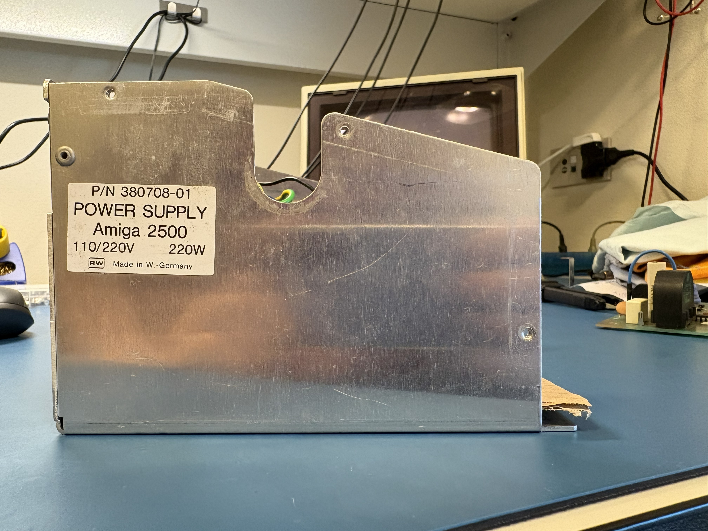
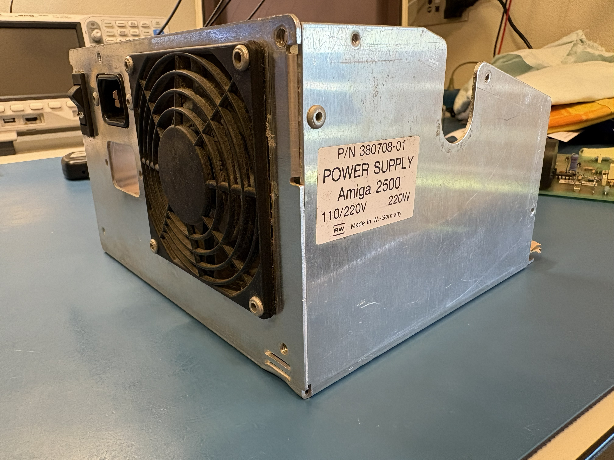

# A2000 Revision 4 Power Supply Unit

<table>
  <tr>
    <td></td>
    <td></td>
  </tr>
</table>

## English

[**🇮🇹 click here for Italian**](#ita)

### Reverse Engineering the Amiga 2000 Rev. 4 Power Supply

I came into possession of a non-working Amiga 2000 Rev. 4. The power supply let out the magic smoke.

* This Amiga was purchased by its first owner on October 3, 1987 and it was gifted to me beginning of 2026, after having spent at least a couple dozen years in a humid cellar.
* Commodore part number of the power supply: 380708-01, although this P/N doesn't appear to identify this specific PSU model, but rather the Amiga 2000 power supply in general.

Unable to find any documentation online, and knowing that my analog electronics skills are limited, I decided to reverse engineer it to learn something along the way.

* The label on the power supply chassis reads:
  * P/N 380708-01
  * POWER SUPPLY
  * Amiga 2500
  * 110/220V 220W
  * RW Made in W.-Germany
* The following markings can be found on the PCB:
  * RW - SNT 220/002
  * NRI
  * AFT

* To reconstruct the schematic, I took a backlit photo of the PCB's copper side with the components still mounted, and then, with a lot of patience, traced the copper paths in Photoshop. Once that was done, it became "easy" to determine the component placement on the PCB and prepare to recreate the entire project in KiCad — a task that took me more than two weeks.
* I spent many hours trying to figure out the best way to arrange the components in the schematic, since I have no real experience with power supplies and remember very little analog electronics from school. The most time-consuming part was figuring out a sensible component layout (hopefully).
* The transformer reverse engineering was carried out by using a digital multimeter to check continuity between pins and identify which ones were interconnected (e.g. windings, center taps), followed by inductance measurements taken with an LCR meter at a test frequency of 10 kHz.
* There's one component I still can't identify — is it a thermistor? It's R23, positioned right below the transformer in the schematic. Its coating is damaged; the ohm symbol is clearly visible, and MAYBE something like 0.2 (ohms). Measured with a multimeter, it reads 0.2 ohm. In the photos I also included the fuse to show the scale.

Among other things to report:

* Upon power-on, I saw a blue flash of light inside.
* The fuse blew.
* Q2 BUV48A is definitely gone (all pins shorted).
* A 2200uF capacitor is faulty.
* There's about 300 ohms across the fan terminals.

In this repo:

* Current [KiCad](https://github.com/andreamazzai/A2000_Rev4_PSU/releases) and [PDF](schematics/A2000_Rev4_PSU.pdf) schematic
* 1986 [PDF](schematics/A2000_Schematic_PSU_ISMET_RW_SNT_220-001_A1K.pdf) schematics
* Top view [PDF](schematics/Top-View.pdf)
* [Pictures](#pictures--foto)

### Update Log

**2026-06-28** - Last weekend I found the original period [schematics](schematics/A2000_Schematic_PSU_ISMET_RW_SNT_220-001_A1K.pdf) on [a1k.org](https://www.a1k.org/forum/index.php?threads/90242/). It wasn't easy to find them, since besides not knowing German, forum images and attachments aren't visible without registering on the portal, and search engines don't index them. A few days later, a user spotted my post in the thread and invited me to the Acill Classics community on Discord.

**2026-07-05** - It seems that there are at least three power supply revisions built by ISMET:

| Revision | Notes |
| -------- | ----- |
| RW - SNT 220/001 | Schematic dated 1986-10-10, page 1 of the period [PDF](schematics/A2000_Schematic_PSU_ISMET_RW_SNT_220-001_A1K.pdf) |
| RW - SNT 220/001 | Schematic dated 1986-10-16, pages 2-3 of the period [PDF](schematics/A2000_Schematic_PSU_ISMET_RW_SNT_220-001_A1K.pdf) |
| RW - SNT 220/002 | Reverse engineering of my own power supply (SNT220/002 printed on the PCB) |

From what I understand, RW might be a "model" name, whereas SNT stands for "Schaltnetzteil", meaning switching power supply.

AFAIU, RW might be a "model" name, whereas SNT stands for "Schaltnetzteil", or "Switching Power Supply".

I'll try ASAP to summarize the changes between the revisions.

------------------------------

## Italiano

### Reverse Engineering dell'alimentatore dell'Amiga 2000 Rev. 4

Sono venuto in possesso di un Amiga 2000 Rev. 4 non funzionante. L'alimentatore ha fatto il fumetto magico.

* Questo Amiga è stato acquistato il 3 ottobre 1987 presso COMPUTER B. COSTO di Rossi Claudio (Via del Costo, 34 - Thiene - Vicenza) e mi è stato donato a inizio 2026.
* Part number Commodore dell'alimentatore: 380708-01, anche se tale P/N non sembra identificare in particolar modo questo modello di PSU, bensì in generale l'alimentatore dell'Amiga 2000.

Non trovando documentazione su web e sapendo che le mie competenze di elettronica analogica sono limitate, ho deciso di fare il reverse engineering per imparare qualcosa.

* L'etichetta posizionata sullo chassis dell'alimentatore riporta:
  * P/N 380708-01
  * POWER SUPPLY
  * Amiga 2500
  * 110/220V 220W
  * RW Made in W.-Germany
* Sul PCB si trovano le seguenti indicazioni:
  * RW - SNT 220/002
  * NRI
  * AFT

* Per ricostruire lo schema ho scattato una foto in controluce al lato rame del PCB con i componenti ancora montati e poi, con molta pazienza, ho ricostruito le piste in Photoshop. Una volta fatto questo, è diventato "facile" determinare il posizionamento dei componenti sul PCB e prepararsi a ricreare l'intero progetto in KiCad, operazione che mi ha richiesto più di due settimane.
* Ho trascorso molte ore cercando di capire come posizionare al meglio i componenti nello schema, poiché non sono per niente esperto di alimentatori e ricordo pochissimi concetti di elettronica analogica dalla scuola: il compito più lungo è stato capire come disporre i componenti in modo sensato (spero).
* Il reverse engineering del trasformatore è stato eseguito misurando con un multimetro digitale la continuità tra i pin, per identificare quali fossero interconnessi (es. avvolgimenti, centro-derivazione), e successivamente misurando con un LCR meter l'induttanza di ciascun avvolgimento a una frequenza di 10 kHz.
* C'è un componente che mi rimane sconosciuto — è un termistore? Si tratta di quell'R23 che nello schema è posizionato subito sotto al trasformatore. La copertura è rovinata; si legge chiaramente il simbolo dell'ohm e FORSE qualcosa tipo 0,2 (ohm). Al tester, misura 0,2. Nelle foto ho posizionato anche il fusibile per mostrare le proporzioni.

Tra le altre cose da segnalare:

* All'accensione, ho visto luce blu all'interno.
* Il fusibile è saltato.
* Q2 BUV48A è sicuramente andato (tutti i pin in corto).
* Un condensatore da 2200uF è andato.
* Ai lati della ventola ci sono circa 300 ohm.

Questo repository contiene:

* Schema [KiCad](https://github.com/andreamazzai/A2000_Rev4_PSU/releases)
* Schema [PDF](schematics/A2000_Rev4_PSU.pdf)
* Schemi [PDF](schematics/A2000_Schematic_PSU_ISMET_RW_SNT_220-001_A1K.pdf) dell'epoca
* Vista lato componenti [PDF](schematics/Top-View.pdf)
* [Immagini](#pictures--foto)

### Log Aggiornamenti

**2026-06-28** - Nel fine settimana scorso ho trovato gli [schemi elettrici](schematics/A2000_Schematic_PSU_ISMET_RW_SNT_220-001_A1K.pdf) originali dell'epoca su [a1k.org](https://www.a1k.org/forum/index.php?threads/90242/). Non è stato facile trovarli perché, oltre a non conoscere il tedesco, immagini e allegati del forum non sono visibili se non previa registrazione al portale e i motori di ricerca non li indicizzano. Alcuni giorni dopo, un utente ha visto il mio post nel thread e mi ha invitato nella community Acill Classics su Discord.

**2026-07-05** - Sembra che esistano almeno tre revisioni di alimentatori prodotti da ISMET:
  
| Revisione | Note |
| --------- | ---- |
| RW - SNT 220/001 | Schema del 1986-10-10, pagina 1 del [PDF](schematics/A2000_Schematic_PSU_ISMET_RW_SNT_220-001_A1K.pdf) degli schemi dell'epoca |
| RW - SNT 220/001 | Schema del 1986-10-16, pagine 2-3 del [PDF](schematics/A2000_Schematic_PSU_ISMET_RW_SNT_220-001_A1K.pdf) degli schemi dell'epoca |
| RW - SNT 220/002 | Reverse Engineering del mio alimentatore (SNT220/002 stampigliato sul PCB) |

Da quanto capisco, RW potrebbe essere un nome di "modello", mentre SNT sta per "Schaltnetzteil", ovvero alimentatore switching.

## Pictures / Foto

<table>
  <tr>
    <td> Label / Etichetta</td>
    <td> Label / Etichetta</td>
  </tr>
  <tr>
    <td> Top View / Vista dall'alto</td>
    <td> Backlit / Controsole</td>
  </tr>
  <tr>
    <td> Top View / Vista dall'alto</td>
    <td> Top View / Vista dall'alto</td>
  </tr>
  <tr>
    <td> Top View / Vista dall'alto</td>
    <td> Top View / Vista dall'alto</td>
  </tr>
</table>
<table>
  <tr>
    <td> Unidentified component / Componente ignoto</td>
    <td> Unidentified component / Componente ignoto</td>
  </tr>
  <tr>
    <td> Unidentified component / Componente ignoto</td>
    <td> Unidentified component / Componente ignoto</td>
  </tr>
</table>
<table>
