# ENG - A2000 Revision 4 Power Supply Unit

<table>
  <tr>
    <td>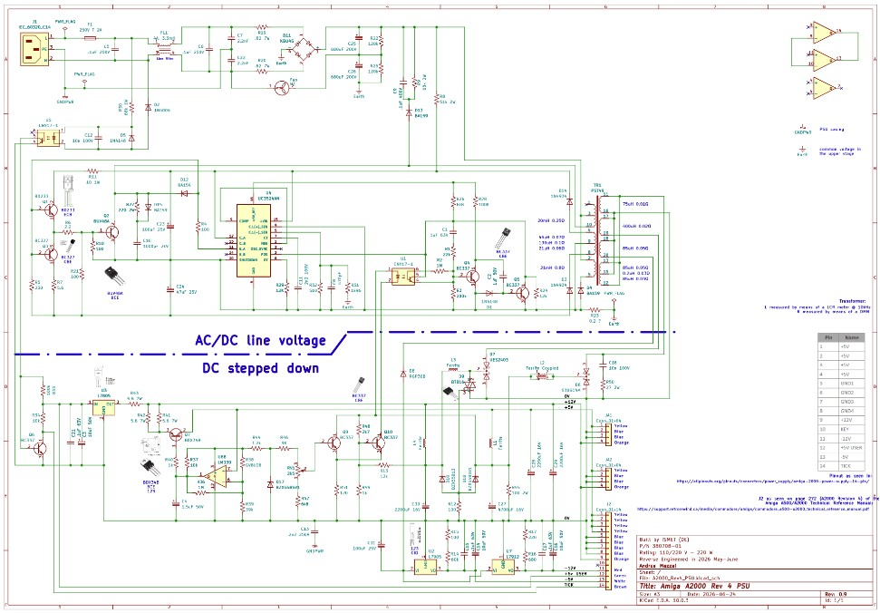</td>
    <td>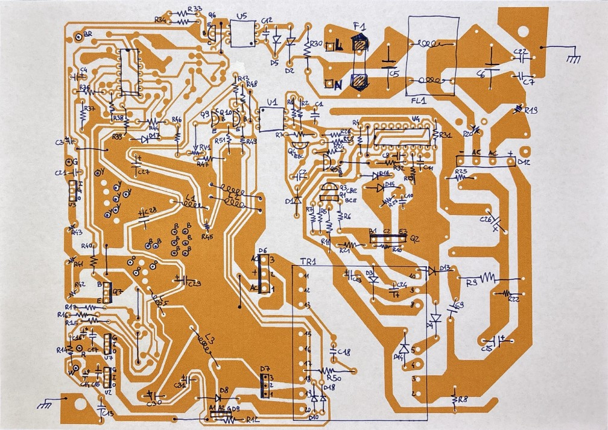</td>
  </tr>
</table>

## English

* This Amiga was purchased by its first owner on October 3, 1987.
* PSU P/N 380708-01

[**🇮🇹 Italian follows**](#ita)

### Reverse Engineering the Amiga 2000 Rev. 4 Power Supply

I came into possession of a non-working Amiga 2000 Rev. 4. The power supply let out the magic smoke.
Unable to find any documentation online, and knowing that my analog electronics skills are limited, I decided to reverse engineer it to learn something along the way.

* To reconstruct the schematic, I took a backlit photo of the PCB's copper side with the components still mounted, and then, with a lot of patience, traced the copper paths in Photoshop. Once that was done, it became "easy" to determine the component placement on the PCB and prepare to recreate the entire project in KiCad — a task that took me more than two weeks.
* I spent many hours trying to figure out the best way to arrange the components in the schematic, since I have no real experience with power supplies and remember very little analog electronics from school: the most time-consuming part was figuring out a sensible component layout (hopefully).
* The transformer reverse engineering was carried out by using a digital multimeter to check continuity between pins and identify which ones were interconnected (e.g. windings, center taps), followed by inductance measurements taken with an LCR meter at a test frequency of 10 kHz.
* There's one component I still can't identify — is it a thermistor? It's R23, positioned right below the transformer in the schematic. Its coating is damaged; the ohm symbol is clearly visible, and MAYBE something like 0.2 (ohms). Measured with a multimeter, it reads 0.2 . In the photos I also included the fuse to show the scale.

In this repo:

* [KiCad](https://github.com/andreamazzai/A2000_Rev4_PSU/releases) schematic
* [PDF](schematics/A2000_Rev4_PSU.pdf) schematic
* [PDF](schematics/Top-View.pdf) helpful drawing
* [Pictures](#pictures--foto)

Among other things to report:

* Upon power-on, I saw a blue flash of light inside.
* The fuse blew.
* Q2 BUV48A is definitely gone (all pins shorted).
* A 2200uF capacitor is faulty.
* There's about 300 ohms across the fan terminals.

## Italiano

* Questo Amiga è stato acquistato il 3 ottobre 1987 presso COMPUTER B. COSTO di Rossi Claudio (Via del Costo, 34 - Thiene - Vicenza).
* Part number dell'alimentatore: 380708-01

### Reverse Engineering dell'alimentatore dell'Amiga 2000 Rev. 4

Sono venuto in possesso di un Amiga 2000 Rev. 4 non funzionante. L'alimentatore ha fatto il fumetto magico.
Non trovando documentazione su web e sapendo che le mie competenze elettronica analogica sono limitate, ho deciso di fare il reverse engineering per imparare qualcosa.

* Per ricostruire lo schema ho scattato una foto in controluce al lato rame del PCB con i componenti ancora montati e poi, con molta pazienza, ho ricostruito le piste in Photoshop. Una volta fatto questo, è diventato "facile" determinare il posizionamento dei componenti sul PCB e prepararsi a ricreare l'intero progetto in KiCad, operazione che mi ha richiesto più di due settimane.
* Ho trascorso molte ore cercando di capire come posizionare al meglio i componenti nello schema, poiché non sono per niente esperto di alimentatori e ricordo pochissimi concetti di elettronica analogica dalla scuola: il compito più lungo è stato capire come disporre i componenti in modo sensato (spero).
* Il reverse engineering del trasformatore è stato eseguito misurando con un multimetro digitale la continuità tra i pin, per identificare quali fossero interconnessi (es. avvolgimenti, centro-derivazione), e successivamente misurando con un LCR meter l'induttanza di ciascun avvolgimento a una frequenza di 10 kHz.
* C'è un componente che mi rimane sconosciuto — è un termistore? Si tratta di quell'R23 che nello schema è posizionato subito sotto al trasformatore. La copertura è rovinata; si legge chiaramente il simbolo dell'ohm e FORSE qualcosa tipo 0,2 (ohm). Al tester, misura 0,2. Nelle foto ho posizionato anche il fusibile per mostrare le proporzioni.

Tra le altre cose da segnalare:

* All'accensione, ho visto luce blu all'interno.
* Il fusibile è saltato.
* Q2 BUV48A è sicuramente andato (tutti i pin in corto).
* Un condensatore da 2200uF è andato.
* Ai lati della ventola ci sono circa 300 ohm.

Questo repository contiene:

* Schema [KiCad](https://github.com/andreamazzai/A2000_Rev4_PSU/releases)
* Schema [PDF](schematics/A2000_Rev4_PSU.pdf)
* Vista componenti [PDF](schematics/Top-View.pdf)
* [Immagini](#pictures--foto)

# Pictures / Foto

<table>
  <tr>
    <td>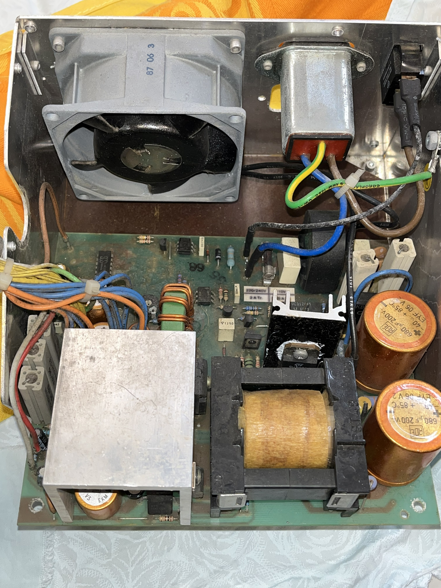</td>
    <td>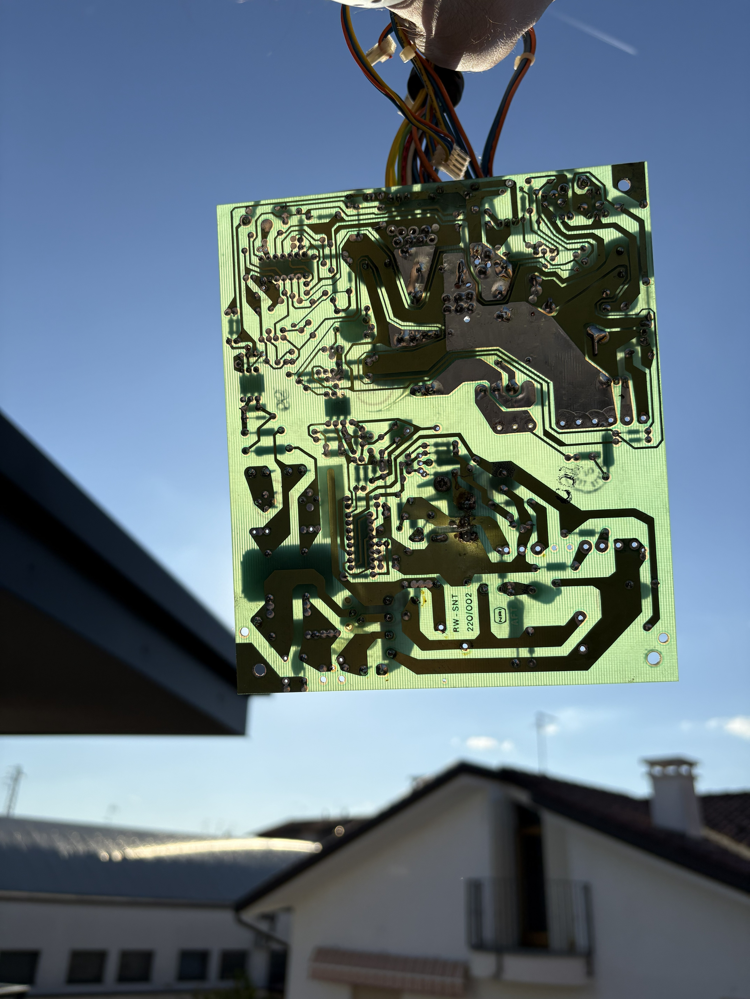</td>
  </tr>
  <tr>
    <td>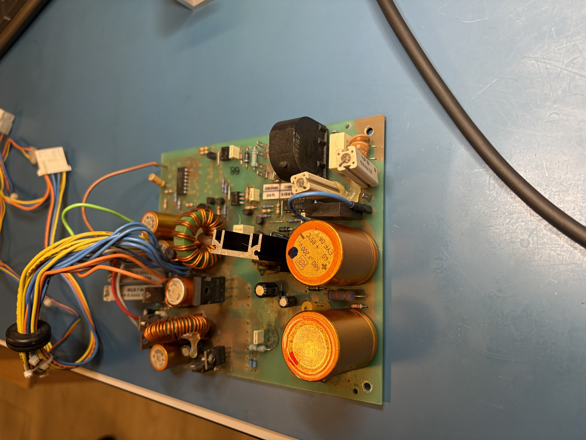</td>
    <td>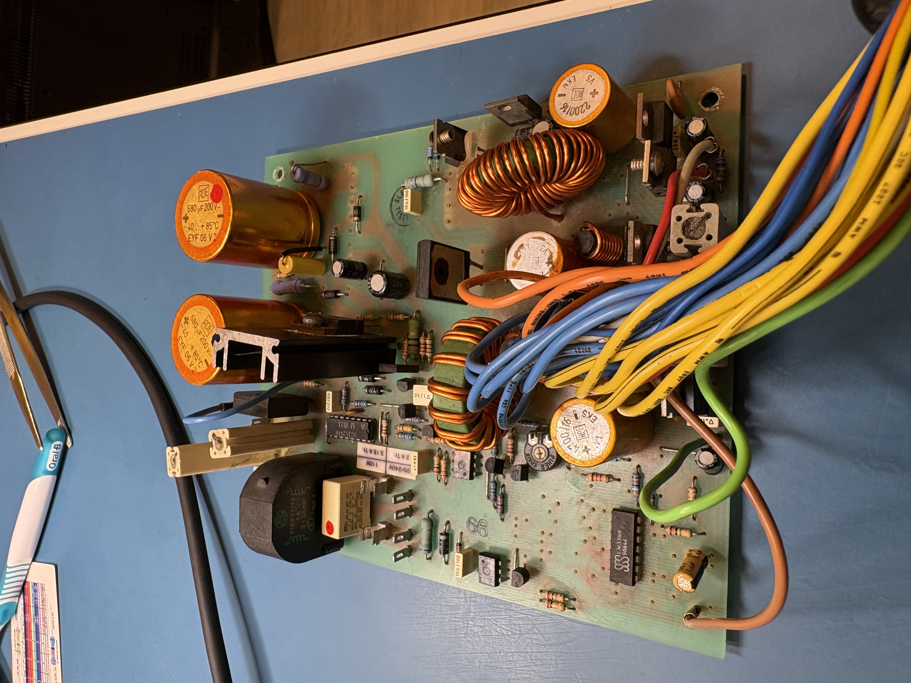</td>
  <tr>
  </tr>
    <td>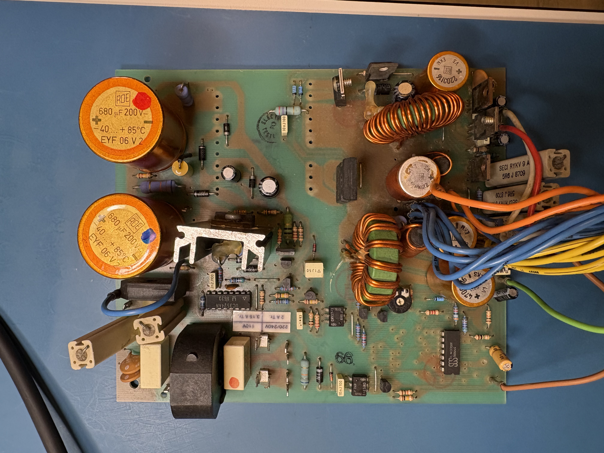</td>
    <td>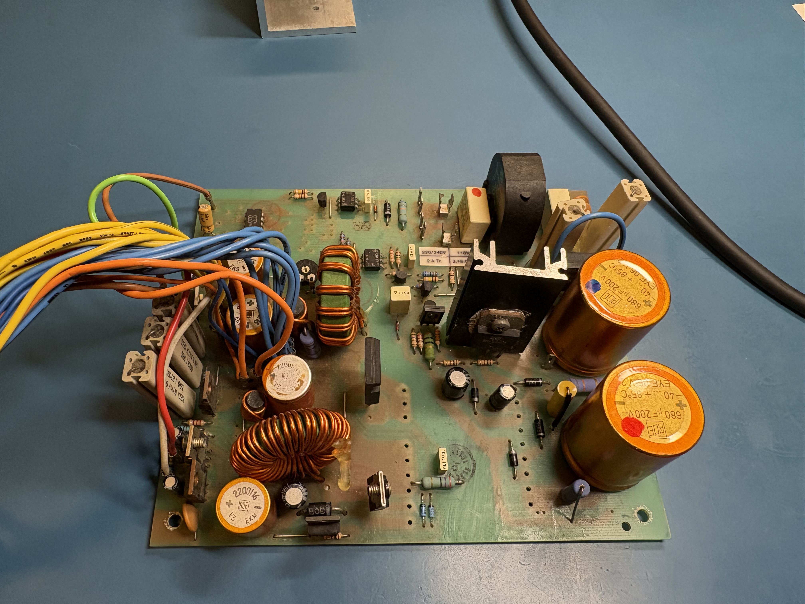</td>
  </tr>
</table>
<table>
  <tr>
    <td>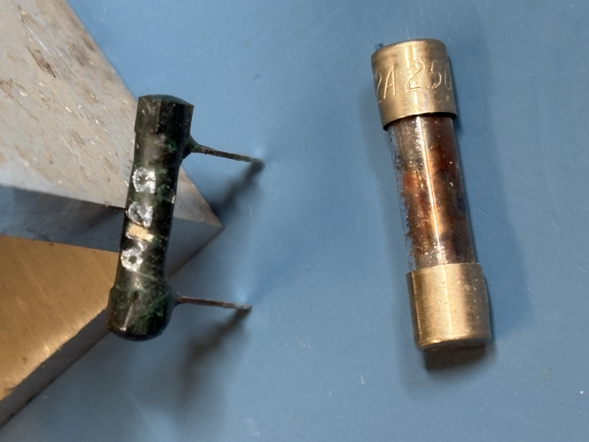</td>
    <td>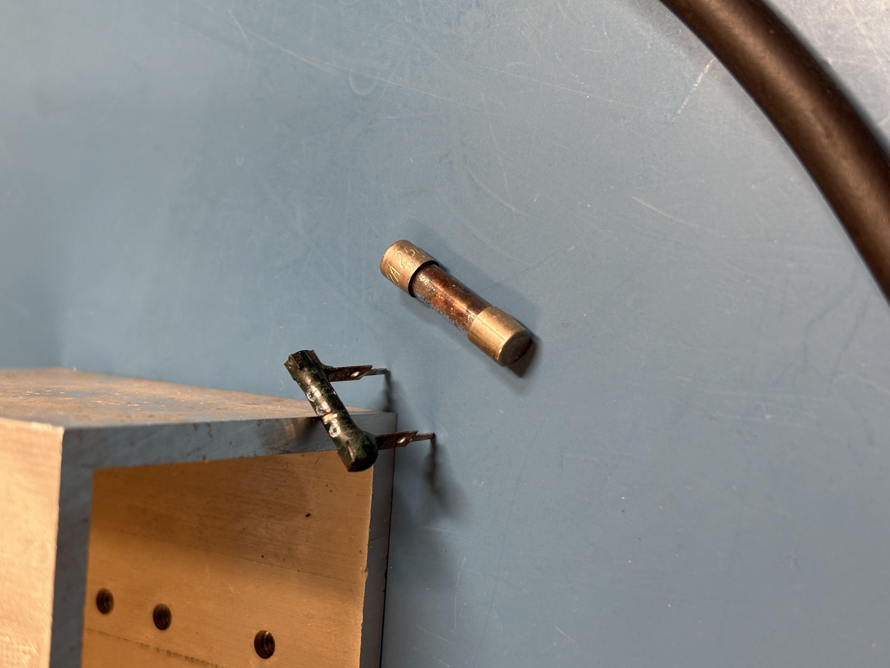</td>
  </tr>
  <tr>
    <td>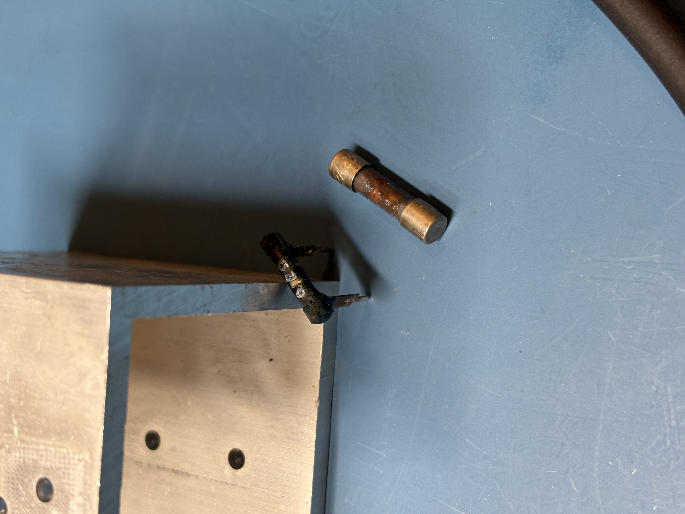</td>
    <td>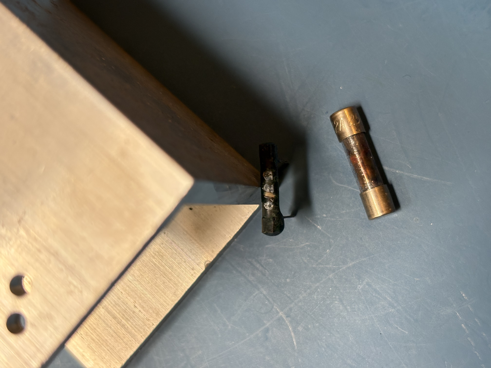</td>
  </tr>
</table>
<table>

